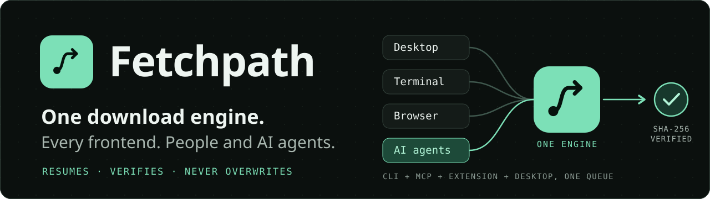

  

# Fetchpath

**One download engine for every frontend, built for people and AI agents.**

Fetchpath is a free, open source download manager for Windows 11. A single
background engine owns your downloads; the desktop app, the terminal, your
browser and AI agents are all just ways in to the same queue. It resumes,
checks that what arrived is exactly what you asked for, and never overwrites a
file. It also handles torrents, video and audio, and Hugging Face models.

**[Download Fetchpath](https://github.com/idcesares/fetchpath/releases/latest)**
(Windows 11, x64), install it, then paste a link into the window.
This page describes **0.2.0**; the release page lists
the published versions. See [Installing](#installing) first: Fetchpath isn't
code-signed. The
[user guide](docs/user/GUIDE.md) covers everything else.

## Why it's different

| | |
|---|---|
| **One engine, every frontend** | Desktop, terminal UI, command line, browser extension and MCP all talk to the same engine. Start a download in one, watch it in another. Close any of them and it keeps going. |
| **Agents are first-class** | Claude Code, Codex and other MCP clients download through `fetchpath mcp`, into folders you grant, with everything else waiting for your approval. Agents and people share one list and one set of rules. |
| **Verified, never trusted** | Paste a publisher's SHA-256 and the file is saved only if it matches. Resumes only when the file is unchanged. Never replaces what is already on disk. |
| **Honest speed** | Adaptive parallel connections beat single-connection curl, aria2 and wget2 where servers limit each connection (3.2 s against 8.2 s in our fixture), and lose where they don't. We publish both, with settings. [Measurements](docs/development/ADAPTIVE-HTTP.md#tool-comparisons-fp-087-30-september-2026). |
| **Small, local stack** | A Rust engine and a Tauri desktop. No model call anywhere in the download path. |

## What it does

- **One list for everything.** Queue a single link or a whole batch, start
  downloads now or at a set time, and search and filter what you have.
- **Pause and resume.** A paused download carries on from where it stopped,
  even after a restart. If the file changed on the website in the meantime,
  Fetchpath starts again rather than joining two different files.
- **Never overwrites.** A file that's already there is never replaced.
- **Torrents and magnets.** Add a magnet, a `.torrent` link or a local
  `.torrent` file to the same list. Fetchpath picks a new folder in your
  Downloads folder. Peers can see your IP address; uploading is off until
  you choose it. See [torrents](docs/user/GUIDE.md#torrents-and-magnets).
- **Honest progress.** Percent and time left appear only when the website says
  how big the file is. Otherwise you see how much has arrived, not a guess.
- **Checksums.** Paste a publisher's SHA-256 and Fetchpath saves the file only
  if it matches. Every finished download shows the SHA-256 of what arrived.
- **Downloaded once, reused.** A file that matched its checksum is kept in a
  bounded cache, so the same file again comes from this computer, checked
  again, without the network.
- **Models and datasets from Hugging Face.** Paste a repository link and
  every file comes from one pinned commit, checked against the checksums
  Hugging Face states. Public repositories only for now.
- **Your own computers help each other.** Pair two PCs on the same network
  and a download with a checksum is taken from the other one first. Sharing
  is off until you turn it on.
- **Video and audio.** Choose a quality and save it, using `yt-dlp` and
  `ffmpeg`. Fetchpath sets both up for you from their official releases and
  checks them first.
- **From your browser.** Right-click a link in Chrome or Edge and choose
  **Send link to Fetchpath**. Downloads that need you to be signed in keep
  working.
- **Keyboard and screen reader friendly.** Every control has a name, and
  everything can be done from the keyboard.
- **Downloads keep going.** A background engine keeps the one list, so
  closing the window or a terminal never stops a download, and every way in
  sees the same list. Closing the window hides it in the tray by default, and
  quitting the desktop from the tray menu leaves active downloads running. The
  tray belongs to the desktop client; the engine works without it and stops by
  itself about a minute after the last download ends, unless **Always on**
  or LAN sharing keeps it running. Always on also starts it when you sign in. See the
  [background controls](docs/user/GUIDE.md#pause-resume-and-restarts).
- **A command line and an interactive terminal.** `fetchpath download LINK`
  for scripts, the whole queue from the command line, and `fetchpath` on its
  own for a live terminal view with themes, keys and aliases of your own.
- **Rules.** Send downloads to a folder, pick a video quality or require a
  checksum by site, file type or size.
- **AI agents, on your terms.** Agents such as Claude Code can download
  through `fetchpath mcp` into the folders you grant; anything else waits for
  you to approve it. Setup can connect Codex and Claude Code, with no access
  granted automatically. Optional automatic mode relaxes limits inside the
  folders you grant. See [CLI.md](docs/user/CLI.md#ai-agents-mcp).
- **Choose what to install.** Full includes the desktop, terminal, agent
  support, browser integration and torrent helper; Custom lets you choose.
  The desktop, terminal and extension share the new Fetchpath appearance.

## Requirements

Microsoft-serviced Windows 11 releases on a 64-bit Intel or AMD PC. ARM-based PCs aren't supported in
0.2.0.

## Installing

Fetchpath is free, open source software provided **as is**, without a warranty
or a promise of support. You choose what to download and are responsible for
using it lawfully and checking whether its sources and files are safe. Its
[MIT](LICENSE-MIT) or [Apache 2.0](LICENSE-APACHE) licence, at your option,
sets the terms for using Fetchpath.

For 0.2.0, download `Fetchpath_0.2.0_x64-setup.exe` and `SHA256SUMS.txt` from the
[release page](https://github.com/idcesares/fetchpath/releases/latest), check one against the other, and run the installer. It installs just for
you and doesn't need administrator rights. Then open Fetchpath from the Start
menu. The [user guide](docs/user/GUIDE.md#install) walks through each step.

Fetchpath isn't code-signed, so **Windows SmartScreen warns when you run
the installer**. Once the checksum matches, choose **More info → Run anyway**.
Where **Smart App Control** is on, Windows blocks unsigned programs outright
and the unsigned installer can't be run; see the [user guide](docs/user/GUIDE.md#install).

## Limitations

- File links use HTTP and HTTPS. HTTP/2 is used where the server offers it.
  HTTP/3, FTP and SFTP aren't available in the app yet.
- Video and audio can't be paused, and no particular website is promised to
  work; that depends on `yt-dlp`.
- The browser extension is added in developer mode for now. Firefox isn't
  supported yet.
- Torrents have no pause, individual file selection or seeding after completion.
- Always on starts after Windows sign-in; it is not a service. There is no
  remote hub or remote control in 0.2.0.
- Fetchpath doesn't claim to download faster than your browser does.
- Not code-signed, and x64 only.

[Development speed measurements](docs/development/ADAPTIVE-HTTP.md#tool-comparisons-fp-087-30-september-2026) compare the full engine with curl, aria2, wget2 and Chrome, including settings, connection counts and verification time. They are local fixture results; the published installer and Internet performance are not promised by them.

See the [changelog](CHANGELOG.md) for changes since 0.1.0 and the
[release candidate record](docs/development/RELEASE-CANDIDATE.md) for the
release verdict. Claude Code connection setup is checked; its current
model-driven download test remains deferred. Real reboot/sign-in recovery
and sudden power-loss validation remain explicit gaps in the release evidence.

## Licence

Fetchpath is available under either the [MIT licence](LICENSE-MIT) or the
[Apache License 2.0](LICENSE-APACHE), at your option. Third-party components
are listed in
[THIRD-PARTY-NOTICES.md](apps/desktop/src-tauri/THIRD-PARTY-NOTICES.md).
`yt-dlp` and `ffmpeg` aren't part of Fetchpath and keep their own licences.

## Security

Report vulnerabilities privately; see [SECURITY.md](SECURITY.md).
The [browser extension privacy page](docs/user/BROWSER-PRIVACY.md) explains
what link and sign-in data stays on your computer when you send a download.

## Contributing

Building, testing and the project's working rules are in
[CONTRIBUTING.md](CONTRIBUTING.md).
