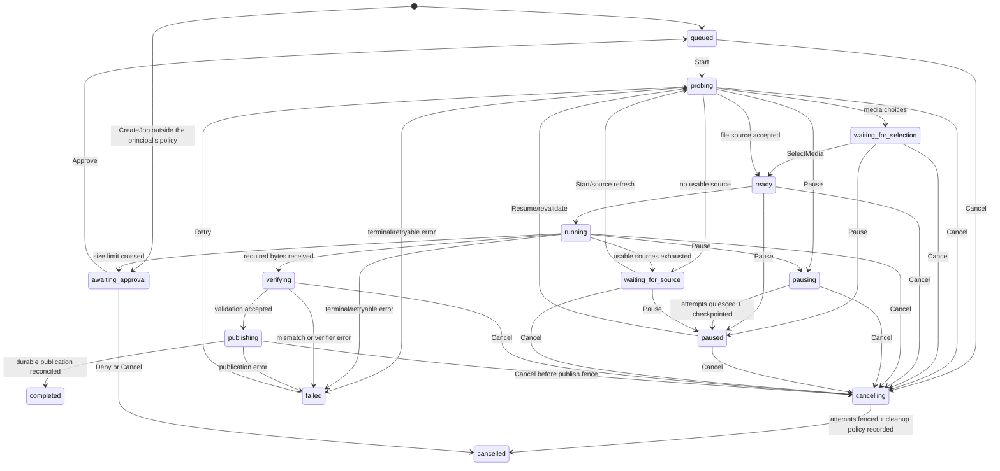

# Job, identity, and event contract

Status: accepted foundation contract for FP-005 · 20 September 2026 · amended by [D1](#14-decision-record) (FP-054, 24 September 2026) and [D2](#d2--corrected-identity-batches-and-link-reviews-fp-055-25-september-2026) (FP-055, 25 September 2026)

This contract is the stable boundary between Fetchpath clients (desktop, CLI, browser bridge), the coordinator, storage, and transfer/media adapters. It specifies behavior before implementation. Rust types may refine representation but must preserve these semantics unless a later decision supersedes this document.

## 1. Invariants

1. A job is user intent; an object is desired bytes; a source is one way to obtain bytes; an attempt is temporary work. Their identifiers are never interchangeable.
2. Bytes are not complete because they exist in a staging file. Receipt, acceptance under a source validator, verification against trusted evidence, durable checkpointing, and publication are separate facts.
3. A locally calculated digest records what Fetchpath received. It proves publisher intent only when compared with an expected digest whose provenance is independently trusted.
4. A full `200` response never satisfies a requested suffix. A resumed HTTP range is accepted only after status, `Content-Range`, byte count, and representation validator checks.
5. Commands are idempotent at the coordinator boundary. Events are ordered per job and clients recover gaps from a snapshot.
6. Cancellation prevents unpublished work from becoming published. A late adapter callback cannot revive a cancelled or superseded attempt.
7. Queued network, verification, and write bytes are bounded. Backpressure is observable and propagates to adapters.
8. Publication never silently replaces an existing destination. Completion is emitted only after required validation and the selected publication durability barrier.
9. Secrets, cookies, authorization headers, signed URL query strings, and private filesystem paths are excluded from routine events and telemetry.
10. Sharing, peer discovery, and upload are explicit policies. A speed profile cannot enable them implicitly.

These invariants protect acceptance criteria A02, A03, and A04. They also constrain later browser, media, and multi-source work.

## 2. Identifiers and versions

All externally visible identifiers are opaque lowercase UUID strings. The core uses distinct newtypes so the compiler rejects accidental substitution.

| Identifier | Lifetime and scope |
|---|---|
| `job_id` | Stable user-visible unit from creation through terminal state and history retention |
| `object_id` | Stable within a job; may later be shared when trusted content identity is established |
| `source_id` | Stable source descriptor within an object; credentials are referenced indirectly |
| `attempt_id` | One probe, fetch, inspect, verify, mux, or publish attempt; never resumed after process restart |
| `command_id` | Client-generated idempotency key in a client namespace; its ledger entry is retained with the job/history record and for a configured minimum tombstone period after purge |
| `reservation_id` | Scheduler lease for a byte range, media component, or other work unit |

Every serialized command, event, and snapshot includes `schema_version`. Version 1 readers reject unsupported major versions with `contract.unsupported_version`; additive optional fields do not change the major version. Timestamps are UTC RFC 3339 strings and never order job work. The sole execution exception is bounded command replay protection: `issued_at` is checked against server time under the explicit skew/retention rules below. Ordering uses integer sequence numbers.

`job_revision` is the client-visible optimistic-concurrency version. `work_generation` fences execution whose accepted bytes or output identity may change. Priority, schedule, and bandwidth edits advance `job_revision` but preserve `work_generation`; source/identity replacement, cancellation, and incompatible restart advance both and explicitly revoke older work.

## 3. Identity model

```text
Job
 └─ ObjectDescriptor
     ├─ opaque object_id
     ├─ requested representation context
     ├─ zero or more expected identities with provenance
     ├─ sources with source-scoped validators
     └─ integrity layout, if trusted piece information exists
```

`ContentIdentity` contains `algorithm`, `construction`, `digest`, `scope`, and `provenance`:

- `algorithm`: initially `sha256`; future additions are explicit.
- `construction`: `flat` or a named tree construction. A flat digest and Merkle root never compare equal merely because their bytes match.
- `scope`: exact output bytes, an encoded HTTP representation, a media component, or another explicitly named object.
- `provenance`: `user_supplied`, `signed_manifest`, `metalink`, `torrent_metadata`, `provider_api`, or `observed_local`.
- `trust`: `expected_trusted`, `expected_untrusted`, or `observed`. Only `expected_trusted` can produce an independently verified result.

HTTP `ETag` and `Last-Modified` values live in `SourceValidator`; they are not `ContentIdentity`. A strong ETag may authorize resume of the same selected representation at the same source. It does not establish equivalence across mirrors. A weak ETag never authorizes `If-Range`. A date may be used only when the HTTP requirements for a strong validator are met; otherwise Fetchpath restarts conservatively.

Representation context includes the effective URL without persisted sensitive query values, method class, relevant content negotiation, content encoding, and source-specific authentication reference. A redirect that crosses an authorization boundary creates or updates a source descriptor; credentials are not copied by default.

### Integrity outcomes

| Outcome | Meaning shown to the user |
|---|---|
| `verified_expected` | Output matches trusted expected identity |
| `consistent_source` | Resume/segments match a strong source validator; publisher authenticity not independently checked |
| `downloaded_observed` | Fetchpath recorded an observed digest but had no trusted expected identity |
| `verification_failed` | Received output does not match required trusted identity; never publish as successful |
| `not_applicable` | Operation such as metadata inspection produced no downloadable output |

A trusted final-file hash permits final acceptance but not early identification of a bad chunk. Selective repair requires trusted piece hashes or another authenticated integrity layout.

## 4. Job kinds and immutable request

Version 1 supports two job kinds:

- `file`: one primary downloadable object from a URL or trusted manifest.
- `media`: inspect a supported page or manifest, select an engine-confirmed format, acquire one or more components, and produce one published output. Format estimates remain approximate until the helper resolves them.

The immutable `JobRequest` records kind, submitted input, destination intent, network/privacy profile, optional trusted expected identity, and creation origin (`desktop`, `cli`, or an identified browser extension). Authentication is an opaque `credential_ref`; clients never embed raw credentials in the command log.

Mutable policy such as priority, schedule, and bandwidth limit is versioned independently. A policy update cannot change the desired bytes, destination conflict policy, trusted identity, or media selection. Those changes create a new job so history and verification remain explainable.

## 5. Commands

Each command envelope contains `schema_version`, `client_id`, `command_id`, `issued_at`, optional `expected_revision`, and a typed payload. For every accepted mutating command, one metadata transaction records the client/command identity, canonical request fingerprint, server `received_at`, mutation, durable event(s), and immutable command result. Only after that transaction commits may the coordinator acknowledge.

Lookup by `(client_id, command_id)` happens before time validation. A retained match with the same fingerprint returns the stored result; a different fingerprint returns `contract.idempotency_conflict`. For an unseen identity, `issued_at` must be no older than `max_command_age` and no later than `max_future_skew` from server receipt time, otherwise it returns `contract.command_expired` or `contract.clock_skew`. Ledger/tombstone retention from `received_at` is at least `max_command_age + max_future_skew`, and may be longer with job history. Therefore no command can remain acceptable after its deduplication record is eligible for purge.

| Command | Preconditions | Result |
|---|---|---|
| `CreateJob(request)` | Valid input and destination intent | New `job_id`, initial revision and snapshot |
| `Start(job_id)` | `queued` or `waiting_for_source` | Schedules/re-probes work or reports why it cannot start |
| `Pause(job_id)` | Any state; outcome follows the command/state matrix | Before the publication fence, requests quiescence; otherwise returns the matrix's no-op or too-late result |
| `Resume(job_id)` | `paused` | Revalidates required source identity, then schedules work |
| `Cancel(job_id, retain_partial)` | Any state; outcome follows the command/state matrix | Before the publication fence, enters `cancelling`; otherwise returns the matrix's terminal no-op or too-late result |
| `Retry(job_id, expected_sha256?)` | Retryable `failed` | Creates new attempts; never reuses an old `attempt_id`. May carry a corrected expected identity (D2) |
| `UpdatePolicy(job_id, patch)` | Non-terminal job and matching revision | New revision; rejects immutable-field changes |
| `ResolveDestination(job_id, decision)` | Waiting on conflict | `choose_new_path`, `replace_existing`, or `cancel`; replacement requires explicit user intent |
| `SelectMedia(job_id, selection_id)` | `waiting_for_selection` and current inspection revision | Freezes the selected format/components and permits transfer |
| `RefreshSource(job_id, source_patch, destination?, expected_sha256?)` | `waiting_for_source`, `paused`, or retryable `failed`; matching revision | Replaces an expired URL or credential reference, advances `work_generation`, and re-probes identity before any retained bytes are reused |
| `RefreshMediaChoices(job_id)` | `waiting_for_selection` before a selection is frozen | Re-inspects and replaces the choice set; stale choice IDs become invalid |

`Pause` and `Cancel` acknowledge receipt separately from completion when their matrix result is `accepted`. That immutable result includes the persisted intent and linearization generation; the definitive outcome is a later state event. Clients may wait for a target state with a timeout and then refresh the snapshot. A repeated command returns the original result even if the job has since progressed.

Optimistic `expected_revision` prevents two clients from silently overwriting policy or media selection. A mismatch returns `contract.revision_conflict` with the current revision, without mutation.

`RefreshSource` accepts a redacted display URL plus a `secret_ref`, never raw secret material in events. Retained ranges may be reused only after trusted content identity or compatible strong representation identity is re-established. Otherwise checkpoints are revoked and the job restarts safely, or the command fails with an action to create a replacement job.

Once `SelectMedia` freezes a selection, changing formats changes desired output identity and therefore creates a replacement job linked by `replaces_job_id`; it is not an update to the existing job. A vanished selected format returns action `create_replacement_job`, optionally after a new inspection. The old job remains explainable and may be cancelled explicitly.

## 6. State machine



`ready`, `pausing`, `cancelling`, `verifying`, and `publishing` may be brief but remain observable for diagnostics. `completed` and `cancelled` are terminal. `failed` records `retryable`; retry creates new attempts without erasing the failure event.

`awaiting_approval` (D1) holds a job an agent asked for outside its policy until a `user` principal approves or denies it; nothing about it starts while it waits.

`waiting_for_selection`, `waiting_for_source`, and destination-conflict waits are non-terminal and carry a `waiting_reason`. Schedules use a separate `not_before` field; a scheduled job stays `queued` rather than inventing another state.

### Command/state outcome matrix

| Current phase | Pause | Cancel | Restart recovery |
|---|---|---|---|
| `queued`, `waiting_for_selection`, `ready`, `waiting_for_source` | Persist `paused` directly; no new work | Persist `cancelling`, then cleanup and `cancelled` | Respect persisted pause/cancel intent; otherwise remain queued/waiting |
| `probing`, `running`, `pausing` | Persist pause intent; fence new scheduling; quiesce accepted writes/checkpoints; then `paused` | Persist cancel intent and new generation; quiesce/reject old work; then `cancelled` | Discard attempts/reservations; honor cancel first, then pause, otherwise re-probe |
| `paused` | Idempotent no-op returning current state | Persist cancel intent, advance generation, apply retain-partial policy, then `cancelled` | Remain paused unless a persisted cancel intent exists |
| `cancelling` | Return `cancel_in_progress`; pause does not supersede cancellation | Return `cancel_in_progress` with the original `retain_partial` policy; a new command cannot alter cleanup already in progress | Reconcile publication intent first, then continue cancellation cleanup to `cancelled` |
| `verifying` | Finish the bounded current verification, then `paused`; do not publish | Fence publication; finish/abort verifier safely, then `cancelled` | Honor cancel/pause intent before any publication; otherwise restart verification from durable facts |
| `publishing`, before publication fence | Persist pause/cancel intent and stop before the fence; `paused` or `cancelled` after reconciliation | Same | Reconcile publication intent, then honor persisted pause/cancel before crossing the fence |
| `publishing`, at/after publication fence | Return immutable `too_late`; reconcile to `completed` or `failed` | Return immutable `too_late_to_cancel`; reconcile to `completed` or `failed` | Publication reconciliation has priority; never restart transfer or report cancellation first |
| `failed` | Idempotently remains failed | Cleanup according to retain-partial policy, then `cancelled` | Remain failed with the same retryability and error record |
| `completed`, `cancelled` | Return terminal no-op result | Return terminal no-op result | Remain terminal after reconciliation |
| `awaiting_approval` (D1) | Idempotent no-op; nothing is running | Persist `cancelled`; a size-limit pause keeps its checkpoint until then | Remain `awaiting_approval` with the same reasons; never start |

The publication fence is a documented platform operation selected by the storage implementation. Publication admission/execution and pause/cancel acceptance share a per-job serialization gate:

1. Before admission, the publisher acquires the gate and transactionally verifies no pause/cancel intent, records publication intent, and marks the publication operation admitted.
2. It holds the gate while crossing or failing the filesystem fence, then transactionally records the observed result before releasing it.
3. Pause/cancel acquires the same gate. If its intent commits first, it advances the generation and publication is prohibited. If publication is already admitted, the command waits for reconciliation: success yields the matrix's too-late result; a pre-fence failure permits the command to commit its normal intent.

This gate prevents a command from returning `accepted` while an already-admitted rename later succeeds. Repeated pause/cancel commands with new IDs receive the current matrix result.

### Race rules

- Every adapter callback carries `attempt_id`, `reservation_id`, and `work_generation`. The coordinator accepts it only when all remain current. Client-visible `job_revision` does not fence transfer callbacks.
- The generation/reservation fence travels with data through receive validation, verifier queues, positional writer execution, and checkpoint commit. Every mutating boundary rejects obsolete work. An overlapping range is not reassigned until already-started writes for the revoked reservation have quiesced; a late old write can neither overwrite current bytes nor contribute a checkpoint.
- Cancelling advances `work_generation`, revokes reservations, tells adapters to stop, drains/rejects callbacks, completes or discards already-started writes under the rule above, and records cleanup before `cancelled`.
- If publication has crossed its irreversible rename/replace fence, cancellation resolves by reconciling publication. The result is `completed` if the intended artifact is present and valid; the command result reports `too_late_to_cancel`. It never reports `cancelled` while leaving a completed artifact as an unexplained side effect.
- Pause revokes new scheduling but preserves accepted work. Resume always revalidates representation identity before appending more bytes.

## 7. Attempts, reservations, and bounded data flow

The scheduler issues a reservation containing the exact work unit, expected source/representation identity, maximum accepted bytes, deadline, and `work_generation`. HTTP version 1 uses one contiguous range per reservation. Media helpers may reserve a component or supervised process stage rather than arbitrary byte ranges.

```text
adapter receive window
    → bounded network queue
    → verifier/validator
    → bounded write queue
    → positional staging write
    → checkpoint barrier
```

Budgets exist globally and per job for active attempts, connections/processes, network in-flight bytes, verification bytes, write bytes, retries, and temporary disk. A full downstream queue pauses adapter reads or the supervised helper where supported. If the helper cannot be paused safely, its own bounded pipe/file contract and disk quota apply. Exceeding a hard budget fails with `resource.limit_exceeded`; it never grows memory without bound.

Progress is derived from committed facts:

- `bytes_received`: accepted from adapters, including data not yet durable.
- `bytes_checkpointed`: safe to reuse under the documented checkpoint policy.
- `bytes_total`: optional; unknown is `null`, never zero.
- `bytes_verified`: covered by the required integrity evidence.
- `network_bytes`: optional transport measurement and may exceed useful bytes.
- `phase`: probe, receive, verify, mux/process, or publish.

Rates and remaining time are estimates with a sampling window and `confidence` (`low`, `medium`, `high`). A client displays no ETA when total or confidence is unavailable. Media component progress cannot be summed unless the adapter supplies a normalized total.

## 8. Events and snapshots

Each durable job event contains:

```text
schema_version, job_id, seq, job_revision, occurred_at,
kind, public_payload, correlation { command_id?, attempt_id? }
```

`seq` increases by exactly one for durable events within a job. The coordinator persists the event and state mutation in the same metadata transaction, together with the command ledger/result when command-driven. Delivery may be duplicated; clients deduplicate by `(job_id, seq)`.

The engine-wide `cursor` that orders a queue subscription (protocol v1, FP-051) may have gaps; a gap is not a lost event. Per-job `seq` stays contiguous; after a crash that cost engine data, the engine skips numbers so that a resubscribing client gets a snapshot boundary rather than a reused number.

Required durable event families are `job_created`, `state_changed`, `policy_changed`, `source_changed`, `media_choices_ready`, `checkpoint_committed`, `integrity_changed`, `waiting`, `warning`, `error_recorded`, and `publication_completed`.

High-rate `progress_sampled` messages use a separate ephemeral `sample_cursor`; they never consume `seq` and may be dropped or coalesced before delivery. The current progress aggregate is included in every snapshot. Durable checkpoint/integrity/state events carry the authoritative progress facts.

`SubscribeJob(job_id, after_seq)` establishes one recovery boundary: the coordinator either replays all retained durable events after `after_seq` and then streams new events, or returns `history_compacted` with an atomic snapshot and subscription positioned after `snapshot.last_seq`. Events committed while the snapshot is produced appear in replay/stream after that sequence. A client never performs an uncoordinated snapshot-then-subscribe pair.

The public payload uses redacted source display values and destination display names. Detailed local diagnostics live behind explicit advanced-mode access and still redact secrets.

## 9. Error contract

An error has stable `code`, user-facing `message_key`, `retryable`, `action`, `scope`, and redacted diagnostics. UI text is localized outside the core. Initial code families:

| Family | Examples | Expected action |
|---|---|---|
| `input.*` | invalid URL, unsupported scheme, unsafe filename | correct input |
| `auth.*` | expired session, credentials required, forbidden redirect | refresh authorization |
| `source.*` | unavailable, range ignored, validator changed, throttled | wait, fallback, or restart safely |
| `integrity.*` | expected hash mismatch, piece mismatch | never publish; retry only with justified source strategy |
| `storage.*` | disk full, permission denied, destination conflict | free space, choose path, or explicitly replace |
| `resource.*` | memory/process/temp quota exceeded | lower concurrency or change policy |
| `media.*` | unsupported site, format vanished, helper/mux failure | refresh an unfrozen choice set, create a linked replacement job for a different frozen format, or update helper |
| `contract.*` | revision conflict, unsupported version, invalid transition | refresh client or update software |
| `policy.*` (D1) | command not permitted for this principal, credentials from an agent, too many pending approvals, approval denied | the person changes agent access or decides; the agent cannot fix it itself |
| `internal.*` | invariant violation, metadata failure | preserve diagnostics and stop unsafe work |

Retryable errors specify a bounded `retry_after` or backoff category. UI buttons come from `action`, not string parsing. An unrecognized error remains safe and visible as `internal.unknown`; clients do not assume it is retryable.

At the process boundary (protocol v1, `crates/fetchpath-protocol`, FP-050, 24 September 2026) the `contract.*` family also carries `contract.malformed_message` (a frame that is not a readable JSON object, or a known command with an invalid field), `contract.message_too_large` (a frame over the protocol's size cap), `contract.unknown_command` (a command type this engine does not know; refused with its `command_id` so a newer client can explain it), `contract.unknown_job`, and `contract.engine_unavailable` (a client that cannot reach the engine). The first three close only the offending connection. The pipe transport (FP-052) adds `contract.connection_lost`, `contract.connection_timed_out` and `contract.engine_already_running`; `auth.engine_secret_missing`, `auth.engine_secret_invalid`, `auth.engine_secret_unreadable`, `auth.engine_secret_unwritable`, `auth.handshake_failed` and `auth.peer_not_engine` for the handshake; and `resource.pending_limit` for a connection with too many unanswered commands. The session (FP-051) adds `contract.unsupported` (a command this engine cannot carry out yet), `input.invalid_request`, `internal.persistence_failed` (retryable: resend the same envelope), `resource.subscriber_lagging` (an event stream too far behind; resubscribe from the last position seen), and, for jobs waiting on a person, `source.link_expired` and `auth.browser_context_lost`. FP-070 adds `storage.queue_from_newer_version` (action `update_software`, not retryable): the queue was saved by a newer build, so the engine shows it unchanged, starts nothing, refuses every change except `EngineShutdown` with this error, and reports it in the optional `EngineStatus.queue_read_only`.

## 10. Checkpoint and publication contract

A checkpoint covers explicit completed ranges and the identity evidence under which they were accepted. A range becomes reusable only after:

1. Accepted bytes are written at the staging offset.
2. The configured payload durability barrier completes.
3. Metadata transaction commits the covered range, local retention digest when needed, source validator, and job sequence event.

After restart, attempts and reservations are discarded. Publication intent is reconciled before cancellation or destructive cleanup so an already-crossed publication fence cannot be hidden. The coordinator then continues persisted cancellation intent, honors persisted pause intent, or resumes normal recovery in that order. Normal recovery reconciles staging-file existence/length with checkpoint metadata, verifies retained ranges when required, and re-probes source identity. Bytes outside committed checkpoints are untrusted and may be overwritten. A local checkpoint digest detects retained-byte changes but does not upgrade integrity provenance.

Publication uses a destination-volume staging file. It flushes required content, records publication intent, checks destination conflict policy again, crosses a platform-specific publication fence, and then reconciles metadata. Recovery checks both the intent and filesystem result. A cross-volume final move is implemented as a staged copy on the destination volume followed by validation and publication; it is never described as an atomic rename.

The durability profile is explicit:

- `recoverable`: protects application/process interruption; recent checkpoints may require re-download after OS/power loss.
- `durable`: uses stronger payload and metadata barriers intended to survive OS/power loss, validated on supported Windows/filesystem configurations.

Until durable-mode testing exists, the product promises only the `recoverable` profile. Process-kill tests do not prove power-loss durability.

## 11. Resume decision table

| Available evidence after interruption | Allowed behavior |
|---|---|
| Trusted piece hashes | Reuse individually matching pieces; re-fetch failures |
| Trusted final hash plus current strong source validator | Reuse checkpointed ranges; final output remains provisional until final hash passes |
| Current strong HTTP validator, no expected hash | Reuse checkpointed ranges from that representation; outcome is `consistent_source` |
| Weak/no validator and no trusted identity | Restart object from byte zero |
| Validator changed or response contradicts requested range | Revoke incompatible checkpoints; restart or require another trusted source strategy |
| Only observed local digest | Use it to detect staging-file changes; it cannot establish remote representation identity |

## 12. Contract examples

Creating the same job command twice, in the protocol v1 wire form (FP-050). The link travels whole once, as a sensitive value the engine never logs or displays; the ledger keeps its fingerprint, not the link. A browser capture instead names its stored context with `{ "type": "credential_ref", "credential_ref": "…" }`. Destination directory references and network profiles are not in v1; they are additive fields when they land.

```json
{
  "schema_version": 1,
  "client_id": "018f9c2a-0d55-74cc-b6c0-7cc8b1c9f221",
  "command_id": "018f9c2a-2f70-7b42-8d6f-5bcb546e11aa",
  "issued_at": "2026-09-20T12:00:00Z",
  "payload": {
    "type": "CreateJob",
    "request": {
      "kind": "file",
      "input": { "type": "url", "url": "https://example.test/file.bin" },
      "destination": { "path": "C:\\Users\\person\\Downloads\\file.bin", "conflict": "ask" }
    }
  }
}
```

The second submission returns the original `job_id` and revision. It does not create a duplicate. `crates/fetchpath-protocol/tests/protocol.rs` decodes both examples in this section.

A safe progress event:

```json
{
  "schema_version": 1,
  "job_id": "018f9c2a-525c-7b9a-986c-b0707def18bb",
  "sample_cursor": 41,
  "job_revision": 3,
  "occurred_at": "2026-09-20T12:00:04Z",
  "kind": "progress_sampled",
  "public_payload": {
    "phase": "receive",
    "bytes_received": 8388608,
    "bytes_checkpointed": 4194304,
    "bytes_verified": 0,
    "bytes_total": null,
    "rate_bytes_per_second": 3145728,
    "eta_seconds": null,
    "confidence": "low"
  },
  "correlation": { "command_id": null, "attempt_id": null }
}
```

## 13. Implementation and review gates

FP-009 must implement a narrow subset: file jobs, create/start/cancel, snapshots/events, one source, bounded pipeline, observed SHA-256, destination conflict handling, and safe publication. Pause/resume and durable checkpoints belong to FP-011. Media inspection/selection uses the same job/event vocabulary in FP-014.

The implementation review must derive tests from the invariants: duplicate commands, revision conflicts, event gaps, unknown totals, late callbacks after cancellation, validator changes, full-200-on-range, truncation, disk full, destination races, and crashes around checkpoint/publication. Any change to identity trust, cancellation fencing, checkpoint ordering, or publication requires lead review and a superseding decision record.

## 14. Decision record

### D1 · Principals, agent policy and `awaiting_approval` (FP-054, 24 September 2026)

Supersedes the assumption, implicit in §5 and §6, that every command comes from the person at the keyboard. Source: [engine platform design §6](specs/2026-09-24-engine-platform-design.md#6-principals-policy-and-approval).

- **Principal per connection.** A connection declares `user`, `browser` or `agent:<name>` once, in its transport handshake; an absent declaration is `user`. The engine, not the client, enforces the principal's permissions on every command. A command outside them is refused with a `policy.*` code. Commands are allowed per principal by an explicit list, so a future command is never open to agents by accident.
- **Who may do what.** `user`: everything. `browser`: `CreateJob` only. `agent:<name>`: `CreateJob`; on jobs it created, `Start`, `GetJob`, `JobDetails`, `ListJobs`, `History`, `SubscribeJob`, `Pause`, `Resume`, `Cancel`, `Retry`, `RemoveJob`, `UpdatePolicy`, `RefreshSource` and `ResolveDestination` (new path or cancel); plus `InspectMedia` and `EngineStatus` (its counts cover only the agent's jobs). A job another principal created answers `contract.unknown_job`, exactly as a missing one does. Settings, agent access, approvals, queue-wide streams and statistics, and engine shutdown are `user` only.
- **Hard refusals, not approvals.** From an agent, a link with user info, a stored `credential_ref`, and `replace_existing` are refused outright (`policy.credentials_not_allowed`, `policy.replace_not_allowed`). Approving them would let a misled agent have a person rubber-stamp credential use or an overwrite; the person can still do either from their own client.
- **Out of policy becomes `awaiting_approval`.** A job whose destination is not inside a folder granted to that agent, or that exceeds the agent's rate of new jobs, is created in `awaiting_approval` with its reasons (`outside_granted_folders`, `rate_limit`). A destination is inside a grant when its deepest existing ancestor, with links and junctions resolved, lies within the resolved granted folder; `..` is refused for everyone. A running agent job whose stated or received size passes the agent's limit is stopped at its checkpoint and moved to `awaiting_approval` (`size_limit`). The limit is checked each time the engine samples progress, so a download that publishes within one sampling interval of crossing it completes; it cannot exceed the limit by more than one interval of transfer. An agent with no configured access has no granted folders, the default size limit and the default rate. Only a bounded number of approvals per agent may wait at once; beyond that `CreateJob` is refused (`policy.too_many_pending`).
- **Leaving the state.** Only a `user` principal may `ApproveJob` (to `queued`, resuming from any retained checkpoint; approving a size stop lifts the limit for that job only) or `DenyJob` (to `cancelled`, recording `policy.approval_denied` so the agent can relay it). The job's agent may `Cancel` (withdraw) or `RemoveJob` it; a withdrawn request keeps its reasons, so the agent retrying it waits for the person again. Whenever an agent retries a job, gives it a new link or a new path, its grants are checked again and a new link drops any size approval. No other command starts a job that is awaiting approval, and the wait survives an engine restart. An approval or denial that meets a size stop which already published reports the completion.
- **Ledger identity.** The command fingerprint includes a non-`user` principal, so a command id reused across principals is an idempotency conflict and never returns another principal's stored result.
- **Threat model.** Unchanged from the design: the pipe admits only the current user and both sides prove the per-install secret. A program already running as the same user can claim `user`; that is out of scope and documented as such.

### D2 · Corrected identity, batches and link reviews (FP-055, 25 September 2026)

Moving the desktop onto the engine needed three things its own queue did in
process. Source: `crates/fetchpath-protocol/src/command.rs`.

- **Correcting the expected identity is an identity replacement on the same
  job.** `Retry`, `RefreshSource` and `ResolveDestination(choose_new_path)`
  take an optional `expected_sha256` (an empty value removes it);
  `RefreshSource` may also carry a new destination, so a new link, path and
  checksum change in one step. Only a `user` principal may send these
  fields; an agent keeps using `ResolveDestination` without a checksum, under
  its grants. The session has no separate `work_generation` yet, and a retry
  may resume staged bytes. That stays safe because the expected SHA-256 is
  compared with the hash of the whole staged file at publication
  (`fetchpath-core` `transfer::publish`), so a changed checksum can never
  pass bytes it was not checked against. A replacement job was rejected: the
  client cannot build one for a link whose private query it never saw.
- **`CreateJobs(requests)`** creates file jobs all or none, as the queue's
  batch always did. `user` only.
- **`TakeLinkReviews`** returns, once, media pages the person sent from the
  browser, for a format choice in their client. `user` only. It is not
  ledgered, so the links never reach the ledger file. Since FP-056 each
  page's capture stays pending in the browser inbox until it is handed out
  here, and only then is marked done and its unused protected context
  deleted, so an engine that stops first loses none; a reply lost in transit
  still loses those links.
- **`TakeBrowserCaptures`** (FP-056) takes the browser inbox in now instead
  of at the next tick, and answers `CapturesTaken`. `browser` and `user`
  only. It is not ledgered: intake is idempotent by capture id and
  credential reference, and the inbox stays the durable handoff. The browser
  host sends it after each accepted capture, or starts an engine, which takes
  the inbox in before it serves; an engine that does not know it answers
  `contract.unknown_command` and takes the inbox in at its next tick.

### D3 · An agent reads its own access (FP-065, 27 September 2026)

Supersedes the part of D1 that makes agent access `user` only, for reading.
Source: `crates/fetchpath-session/src/engine.rs`, `policy.rs`.

- **`GetAgentPolicies` from an agent** answers with that agent's own entry
  only: its granted folders, size limit and rate, or the defaults (no
  folders) when the person has not configured it. It never lists another
  agent. `SetAgentPolicy`, approvals and every other access change stay
  `user` only.
- **Why.** The MCP server (`fetchpath mcp`) needs the grants to offer a
  default folder that does not wait for approval, and to show saved paths
  only when they lie inside a granted folder, using the engine's own
  `inside_grants` so client and engine resolve links and junctions alike.
  An agent could already learn its grants by trying destinations; reading
  them adds no power.
- **`History` from an agent** matches its words against a destination's
  folders only when that destination lies inside the agent's grant, and
  otherwise against the file name alone, so repeated searches cannot spell
  out a folder the agent is not shown (found by the FP-065 review).
