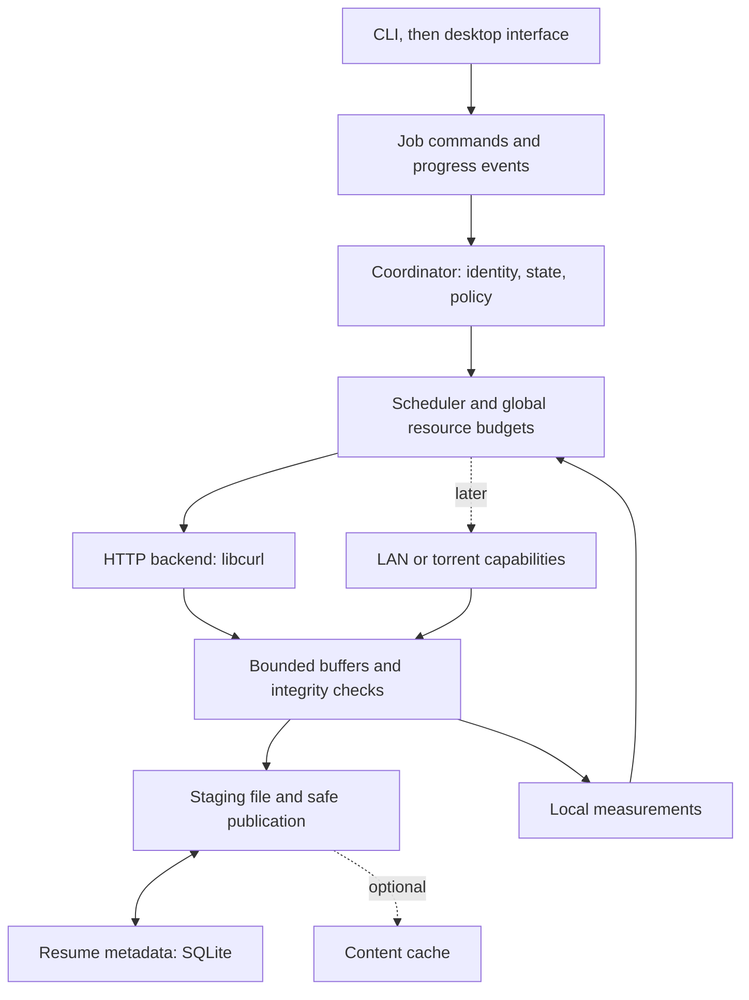

# Fetchpath: architecture and development plan

Revision 0.3 · Research checked 19 September 2026 · Product direction incorporates the user's answers; implementation choices remain proposals

Confirmed product direction and open decisions are owned by [PROJECT.md](../../PROJECT.md). Model routing is in [the task workflow](../development/WORKFLOW.md).

## 1. What we should optimize

Optimize time from accepting a job to publishing the correct file, subject to resource and privacy limits. Track CPU, memory, network waste, energy where measurable, and interference with other traffic separately. The report's product-of-costs efficiency formula is useful intuition, but it mixes units and can hide tradeoffs. It should not become the scheduler's literal objective.

A rough throughput ceiling is the minimum of source capacity, usable path capacity, receive/crypto capacity, verification capacity, and storage capacity. Multiple mirrors help only when they relieve the actual bottleneck. A client cannot manufacture upstream bandwidth, server cooperation, or trusted identity.

The strongest opportunities are dependable interruption recovery, economical adaptation across varying servers, low overhead on fast connections, and avoiding bytes when trustworthy metadata permits reuse. A list of protocols alone is insufficient differentiation: aria2 already supports segmented and multi-source transfers, Metalink, and BitTorrent. [aria2's documented capabilities](https://aria2.github.io/manual/en/html/README.html)

## 2. The product: simple by default, powerful on demand

The first public Fetchpath should feel like a finished Windows application. Interface design starts alongside engine discovery. The CLI provides testability and automation; it is not a substitute for the requested desktop experience.

The main view should center on an understandable queue: file, source, progress, speed, estimated remaining time when credible, and the next available action. A download detail view can reveal sources, protocol, verification, and performance diagnostics. Advanced mode adds controls to the same jobs; it must not create a separate product or require technical tuning for good defaults.

Design these journeys before expanding the interface:

1. Paste a link or send a browser download; confirm destination and start with sensible defaults.
2. Select several links, preview/filter the batch, and queue them without repetitive dialogs.
3. Pause, close the window, disconnect, reboot, and return to understandable recoverable state.
4. Resolve expired sessions, destination conflicts, low disk space, or unsupported capture with a specific action.
5. Choose a media quality or audio format when available, with size estimates marked approximate.
6. Open advanced controls for scheduling, per-site limits, proxy/auth settings, checksums, and diagnostics.

Provide system light/dark themes, keyboard access, screen-reader labels, scaling, reduced motion, clear units, and non-color-only status. Keep progress events throttled and large queues virtualized so presentation does not compete with transfer performance. Include tray behavior, search, history, notifications, and clear deletion semantics. Closing a window and stopping a download must be distinct actions.

### Proposed compatibility matrix

| Capability | Target placement | Key acceptance boundary |
|---|---|---|
| HTTP/HTTPS, redirects, ranges, unknown lengths, large files, Unicode names | Launch foundation | Correct file and understandable recovery across a fixture corpus |
| Chrome and Edge integration | Launch | Explicit send-to-Fetchpath plus tested automatic capture; safe browser fallback |
| Firefox integration | Launch candidate | Validate its own extension and native-host behavior rather than assume Chromium parity |
| Sessions, cookies, signed links, referer-dependent downloads, proxy support | Launch compatibility | Transfer only authorized context; explain refresh requirements; never leak secrets |
| Batch links, clipboard opt-in, queues, schedules, destination/category rules | Launch experience | Preview work, avoid duplicate jobs, recover schedules after sleep/restart |
| HTTP/2 and opportunistic HTTP/3 | Launch performance | Detect actual packaged capabilities and prove fallback |
| Video/audio, supported HLS/DASH on-demand media, quality selection | Confirmed launch requirement | Verified supported-site corpus, correct audio/video assembly, explicit unsupported cases |
| FTP, FTPS, SFTP | Proposed launch compatibility pack | Separate authentication, resume, certificate/host-key, and path tests |
| Torrents/magnets and Metalink | Subsequent compatibility wave | Explicit sharing policy, correct identity and resource control |
| Provider adapters, including model/data repositories | Subsequent specialization | Correct auth/version resolution and comparison to official clients |
| Trusted LAN/offline cache and cooperative multi-source | Enhanced distribution wave | Pairing, authorization, verified content reuse |
| Mobile, broad Internet peer traversal, FEC/multipath experiments | Later | Independent product and measured feasibility gates |

This is a coverage roadmap, not a claim that every website or browser-generated download can be captured. Track each combination as supported, partial, unsupported, or untested, with evidence and a tested version.

Browser integration is itself a product feature: IDM exposes capture settings, exclusions, and a way to keep a download in the browser. Fetchpath should offer similarly clear user control. [IDM integration options](https://www.internetdownloadmanager.com/support/using_idm/options.html)

Use browser-native messaging for control handoff; payload bytes stay in the native engine. Chrome documents a registered host and permitted extension origins. A download event is not a universal export of its original request, response body, or authentication context. Prototype simple GET, authenticated GET, POST-generated downloads, blob URLs, and expiring URLs separately. Keep unsupported requests in the browser; cancellation must follow an acknowledged, reproducible handoff. [Chrome native messaging](https://developer.chrome.com/docs/extensions/develop/concepts/native-messaging), [downloads API](https://developer.chrome.com/docs/extensions/reference/api/downloads)

For media, evaluate a supervised yt-dlp helper and FFmpeg rather than building a website extractor ecosystem. yt-dlp documents format selection and FFmpeg-dependent audio/video merging; its supported-site list explicitly warns that sites change. Pin tested helper versions, maintain an update path, capture structured status, and isolate failures. Some helpers may retain control of their own transfers; the global coordinator should enforce available process/job budgets without claiming control it lacks. [yt-dlp](https://github.com/yt-dlp/yt-dlp), [supported-site caveat](https://github.com/yt-dlp/yt-dlp/blob/master/supportedsites.md)

## 3. Research conclusions and changes to the supplied proposal

| Finding | Consequence for Fetchpath |
|---|---|
| HTTP/3 is a candidate, not a universal speed advantage. A 2023 study observed a broad 90–4,900 Mbit/s range among QUIC implementations on its 10 Gbit/s testbed. These are historical measurements, not current library rankings. [Research paper](https://arxiv.org/abs/2309.16395) | Measure our actual client/server builds on our hardware; retain HTTP/2 and HTTP/1.1 paths. |
| Current curl documentation identifies ngtcp2 as its non-experimental QUIC backend; curl's quiche integration is labeled experimental. HTTP/3 requires a compatible QUIC, HTTP/3, and TLS build. [curl HTTP/3 documentation](https://curl.se/docs/http3.html) | Prototype packaging early. Provisionally evaluate libcurl with ngtcp2, nghttp3, and a supported TLS library. |
| MsQuic provides QUIC transport APIs. A generic QUIC connection does not implement HTTP request semantics, HTTP/3 framing, and QPACK. [MsQuic API](https://github.com/microsoft/msquic/blob/main/docs/API.md) | MsQuic is a possible controlled-peer transport; a public-URL HTTP backend also needs an HTTP/3 implementation. Do not label a bare MsQuic adapter an interchangeable HTTP client. |
| Congestion control governs the sender. QUIC explicitly permits sender-side algorithm selection. [RFC 9002 §7](https://www.rfc-editor.org/rfc/rfc9002.html#section-7) | Fetchpath cannot switch a third-party download server to BBR. Compare congestion algorithms on servers/peers we control; optimize receive behavior and scheduling locally. |
| HTTP identity and cryptographic content identity solve different problems. Weak ETags are invalid in If-Range; dates qualify only under strong-validator conditions. [RFC 9110 §13.1.5](https://www.rfc-editor.org/rfc/rfc9110.html#section-13.1.5) | Prefer strong ETags for HTTP resume; do not treat arbitrary Last-Modified timestamps as safe fallbacks. Keep identity scope explicit. |
| A checksum calculated from newly received bytes is a fingerprint, not independent evidence that the publisher intended those bytes. | Store expected and observed hashes separately, together with the expected hash's provenance. Never infer publisher authenticity from a local checksum. |
| A whole-file expected hash can reject a bad result, but cannot identify the damaged chunk. | Require trusted piece hashes for early rejection and selective repair. With only a final hash, use conservative retry/restart and never invent fault localization. |
| SQLite WAL consistency does not make the separately stored payload durable. WAL with synchronous=NORMAL can lose recent transactions after power failure. [SQLite durability settings](https://sqlite.org/pragma.html#pragma_synchronous) | Define ordering across payload writes, flushes, metadata commits, and publication; validate application-crash and power-loss claims separately. |
| libtorrent already owns piece selection and exposes priorities. [libtorrent piece priorities](https://libtorrent.org/reference-Torrent_Handle.html) | Coordinate quotas and desired pieces with its scheduler; do not force all protocols behind a fictional arbitrary-range API. |
| Hugging Face Xet uses reconstruction metadata and chunk retrieval. [Hub download documentation](https://huggingface.co/docs/huggingface_hub/guides/download) | If AI models are a launch workload, benchmark against hf_xet and evaluate a provider adapter. Generic HTTP comparison alone is insufficient. |
| Metalink already describes mirrors and piece hashes. [RFC 5854](https://www.rfc-editor.org/info/rfc5854/) | Import established metadata before designing an external Fetchpath format. A signature format also needs a trust and key-lifecycle design. |
| The retrieved IETF multipath QUIC document is an Internet-Draft. [IETF document status](https://datatracker.ietf.org/doc/draft-ietf-quic-multipath/) | Keep multipath QUIC experimental and recheck status when implementing it. |

curl's download page confirms the report's 8.22.0 release date of 2 September 2026. This is a verified snapshot, not a permanent dependency pin; select and record exact tested versions when development begins. [curl releases](https://curl.se/download.html)

The report's precise VectorCDC, Reverso, and Adaptive-FEC performance figures were not independently reproduced or fully audited here. They remain leads for later research, not evidence for Fetchpath performance targets.

## 4. Capability levels and truthful integrity

| Available evidence | Proposed behavior |
|---|---|
| Ordinary URL with no dependable validator or expected digest | Sequential download; restart after interruption when unchanged identity cannot be established; show “Downloaded — no independent checksum available.” |
| Same selected representation with a strong HTTP validator | Allow validated resume and segmentation. This establishes representation consistency, not publisher authenticity. |
| Trusted expected whole-file hash | Validate the completed artifact. Cross-source assembly may be allowed, but all assembled bytes remain provisional until the final check passes. |
| Trusted manifest with piece hashes | Reject incorrect pieces immediately, combine authorized sources, and selectively repair. |
| Authorized local content with known identity | Reuse matching bytes under explicit cache and sharing policies. |

Use an opaque job ID before a digest is known. Content IDs must encode hash algorithm and construction: a flat SHA-256 digest and a Merkle root are different identifiers. Keep job state, durable storage state, and integrity status separate.

Receiving bytes, accepting them under a representation validator, verifying them against trusted hashes, and durably committing them are separate events. The report's suggestion that VERIFIED is irrevocably available is too strong without durable storage. For ordinary URLs, completion must remain possible without pretending publisher verification occurred.

## 5. Proposed engine

**Core:** Rust, a small async runtime, explicit state transitions, and bounded channels. Start as one reusable library plus a CLI. The desktop host can keep jobs alive independently of windows without requiring a system-wide privileged service. Introduce a separate user-level daemon only when lifecycle or browser integration requires it.

**Update, 24 September 2026:** that point has been reached. A shared queue across the desktop, the command line, an interactive terminal, the browser host and agents (MCP) needs one owner, so a per-user headless engine now owns the queue and every front end is a client of one versioned protocol. See [the engine platform design](specs/2026-09-24-engine-platform-design.md) (FP-047); it does not need a privileged service.

**HTTP:** one backend owner using libcurl's multi interface, with cancellable commands and bounded delivery into the writer/verifier. Prove callback lifetime, pause/resume behavior, connection reuse, TLS trust-store behavior, and Rust/native packaging in a small spike. Do not build a second scheduler accidentally inside each job. A pure Rust backend is an alternative if this integration fails the agreed constraints; implement only one initially.

**Storage:** one staging file on the destination volume, positional writes, a bounded buffer pool, and SQLite metadata. Avoid mandatory CAS duplication on the first release. Define conflict behavior for existing destinations; do not silently overwrite. Size, preallocation, sparse support, disk-full behavior, filesystem limits, and rename semantics need native-platform tests.

**Identity:** track source-specific validators, representation-affecting request context, credential references, and optional trusted digests. Never store bearer tokens or signed URL query strings in routine telemetry. Credentials belong in a protected store with explicit origin scopes.

**Extension boundary:** separate capability descriptions from byte-range transport. HTTP can fetch ranges; torrent engines manage pieces; provider APIs may return reconstruction plans. The coordinator negotiates budgets and desired content with each. Avoid writing speculative interfaces for every future protocol.

**Interface:** first expose add, list, pause, resume, cancel, retry, destination, priority, and bandwidth limit. Desktop progress should distinguish receiving, checking, saving, paused, and waiting for a source. Choose its framework after platform and integration requirements are settled.

## 6. Reliability contract

HTTP range assembly follows RFC 9110: check response status, Content-Range, actual byte count, and representation identity; use If-Range appropriately. A full 200 response must never be appended as the requested suffix. A 416 response is not proof of completion. Prefer identity content encoding for segmented files and verify what was actually returned. [HTTP range semantics](https://www.rfc-editor.org/rfc/rfc9110.html#section-14)

Our initial policy is one contiguous range per request, bounded retries with jitter and server backoff, conservative restart on unresolved representation changes, and a sequential fallback when segmentation is unavailable. Limit redirect chains, keep secrets within their authorized origin scope, and test expiring signed URLs. Replacing a source URL must re-establish identity.

Proposed checkpoint order:

1. Write accepted bytes to their staging-file offsets.
2. Complete the chosen payload durability barrier.
3. Commit the corresponding checkpoint metadata; batch checkpoints to amortize cost.
4. After restart, distrust in-flight ranges. Recheck retained bytes against trusted or recorded checkpoint digests as appropriate; a local digest checks retention, not publisher authenticity.
5. Once all required validation passes, flush the complete staged artifact, persist a publication intent, publish on the destination filesystem, and reconcile the database to that result.

Publication and database commit are not a single filesystem transaction. Recovery must reconcile a crash before or after rename; preserve the existing destination until the replacement policy permits publication. Windows file sharing and antivirus interference require explicit retry/error behavior. A cross-volume move needs a staged destination copy rather than an assumed atomic rename.

Start with conservative durability settings. Measure checkpoint cost before relaxing them, and state any permitted re-download window. Process-kill tests alone cannot establish power-loss durability.

For future shared content, authentication, authorization, and integrity are separate checks. LAN discovery is opt-in; speed modes never silently enable sharing. A content hash is not permission to retrieve or redistribute an object. If a browser bridge is added, authenticate local commands and validate their origin and scope.

## 7. Adaptive performance policy

Start each origin conservatively. For eligible large objects, increase multiplexed range concurrency only while measured completion progress improves without exceeding memory, CPU, disk, or network budgets. Stop splitting small files when the setup cost dominates. Extra streams do not create independent congestion windows within a connection.

Use weighted fair scheduling across jobs, and simple recent-rate estimates within a job. Grow gradually; decrease promptly on throttling or backpressure. Add hysteresis, cooldowns, and bounded exploration so noisy measurements do not cause oscillation. Protocol history should expire and be scoped to the relevant origin/network context. Missing RTT or retransmission telemetry means unknown, not zero.

Adapt transfer ranges without changing the manifest's integrity-block boundaries. One range may contain several integrity blocks, and a block may arrive across multiple reads. Cancelled work must release its reservation; late callbacks must not overwrite a reassigned range. Hedge stragglers only when identity is established and duplicate-byte budgets permit it.

Use HTTP/3 opportunistically with a bounded fallback policy and actual negotiated-protocol reporting. Keep comparison workloads identical. Profile receive copies, allocation, hash time, storage queues, and flush cost before adding native I/O specializations or another transport backend.

Local content reuse needs metadata mapping desired bytes to available content. Running content-defined chunking after downloading an arbitrary new URL cannot by itself avoid that first download. Evaluate CDC only on realistic related-version corpora with usable reconstruction metadata.

## 8. Delivery sequence and exit criteria

These are dependent milestones, not calendar estimates. Estimate effort after the packaging, browser, and media spikes expose their actual constraints. Security and instrumentation begin in the first slice and continue throughout.

| Milestone | Useful result | Depends on | Exit evidence |
|---|---|---|---|
| M0 — Product journeys and baseline | Core desktop flow prototype/specification; small HTTP fixture corpus; existing-client measurements; Windows backend/package spike | Product direction | Agreed flow and capability matrix; reproducible baseline; one packaged candidate negotiates the expected protocols |
| M1 — First complete desktop download | Add URL → destination → progress → safely saved file, backed by reusable core and test CLI | M0 | Native Windows run, independent expected-file comparison, visible cancellation/error states |
| M2 — Dependable queue and recovery | Pause/resume, retries, restart recovery, destination conflicts, bounded storage pipeline | M1 | Fault-injection suite; no accepted mixed-version output; stated durability envelope |
| M3 — Browser and everyday workflow | Chrome/Edge handoff, batch preview, session context, schedules, notifications, advanced detail view; Firefox spike | M1; M2 for recovery | Browser compatibility matrix, handoff acknowledgement/fallback, no lost or duplicate jobs, keyboard-only completion of core flows |
| M4 — Measured acceleration | Adaptive ranges, global budgets, H2/H3 comparison and fallback | M2; M0 harness | Comparative results, bounded resources, no unexplained regressions, protocol evidence |
| M5 — Broad compatibility pack | FTP/FTPS/SFTP; supported media and quality selection confirmed for launch | M1/M2; integration contracts | Real protocol/site fixtures, helper lifecycle tests, correct output, clear unsupported paths |
| M6 — First public-release candidate | Cohesive UI, installer/uninstaller, update strategy, compatibility documentation, accessibility and reliability review | M3/M4 plus confirmed M5 scope | Release acceptance matrix and native installation tests; versioned evidence; remaining limitations documented |
| M7 — Verified multi-source and reuse | Metalink, trusted expected digests/piece maps, mirror failover, bounded cache | M2/M4 | Corrupt/slow/offline mirror tests; final identity; honest retry behavior with final-only hashes |
| M8 — Additional distribution modes | Torrents/magnets, provider-specific adapters, paired LAN/offline distribution | Relevant M7 identity and adapter contracts | Separate protocol/resource/privacy gates; benefits on representative workloads |
| M10 — Engine platform | Queue, persistence, history, settings and policy in one per-user engine; protocol v1 over an authenticated pipe; principals and approval; desktop and browser host as clients | M6 | Characterization tests unchanged across the move; adversarial protocol, ownership and recovery tests; desktop journeys re-verified; upgrade with a retained queue |
| M11 — Terminal client | Full command set over the engine; interactive inline terminal with dashboard, flows, personalization, remembered context and smart rules | M10 protocol | Integration tests over the real engine; render snapshots; keyboard-only and plain-mode walkthroughs in Windows Terminal and the console host |
| M12 — Agent client | MCP server under an agent principal; approval surfaces; adversarial review; platform release gate | M10 policy; M11 for terminal approvals | Policy-escape and injection tests; end-to-end agent download; re-run release matrix |
| M14 — Measured speed parity | Stream-first, work-stealing HTTP scheduler; shared connections and pinned redirects; shaped benchmark against curl, aria2, wget2 and a browser | M4, M10; FP-018 harness | Per-profile paired results with uncertainty; each mechanism passes the §9 gate; claims only where measured |
| M9 — Advanced efficiency research | CDC/delta, multi-interface paths, specialized QUIC, FEC/coding; mobile as its own product track | Evidence of a remaining bottleneck | Reproducible net gain, interoperability, operating cost, and maintenance justification |

M10–M12 (engine platform, terminal and agent clients) take priority over the remaining M8 and M9 work; new M8 job kinds land in the engine session so every client gets them. M0 UX and baseline tasks can run independently. After the shared job/event contract, desktop/browser work can overlap engine work. M2's persistence and recovery contract stays under a single architectural owner. Do not postpone public-release polish until every research feature exists.

## 9. Benchmark plan: earn the speed claim

The first harness should be small enough to use every day. Do not implement the full Cartesian product from the research report before obtaining a single useful result.

Compare native Windows clients against the same controlled origin and content. Use curl and aria2 as engineering baselines, a browser as an everyday baseline, and IDM as a product/performance comparator if a licensed installation is available. For specialized media or AI-model paths, compare the relevant helper/provider client too. Document default settings and separately compare configurations with equal connection/resource budgets.

### Initial workload set

| Scenario | Question |
|---|---|
| Small file and batch of small files, low and moderate RTT | Do probing and UI overhead harm ordinary downloads? |
| Large immutable file on a clean broadband path | Can the engine approach a measured sustainable baseline efficiently? |
| Large file with RTT, random loss, and a separate burst-loss case | Does adaptation improve completion without runaway retries? |
| Server limiting per-connection rate; separate per-client limiting case | Does range/concurrency policy help only where capacity exists? |
| UDP blocked or HTTP/3 handshake failure | Is fallback prompt, correct, and visible in diagnostics? |
| Slow destination storage and constrained memory | Does backpressure bound memory and avoid thrashing? |
| Competing interactive traffic | Does background policy reduce interference? |
| Disconnect, process kill, source replacement, disk full | Does recovery preserve the correctness contract? |

Start with illustrative object sizes around 1 MiB, 100 MiB, and 1 GiB, plus a small-file batch; expand to 10+ GiB and multi-gigabit hardware when available. Use selected network profiles rather than all possible combinations. Generate content locally with recorded expected digests. A Linux router/VM may provide network shaping, but run the Windows client natively; do not treat WSL filesystem results as native Windows evidence.

Measure time to usable file, delivered bytes, verified goodput for fixtures with known expected content, CPU-seconds/GiB, peak memory, network overhead, disk/flush time, and cancellation/recovery behavior. Record application bytes separately from on-wire bytes where captures are available. Retransmissions, duplicates, and cache hits need separate accounting. Warm-cache effective completion speed is not WAN throughput.

Use paired randomized runs, explicit warm/cold cache policies, fixed builds and fixtures, and raw logs. Begin with five paired repetitions as a pilot and increase repetitions when variance obscures the decision. Publish uncertainty; a five-run sample cannot substantiate tail percentiles. Measure p95/p99 only with sufficient samples. Record OS, CPU, storage, NIC, server, TLS/HTTP backend versions, settings, and whether hashing/publication time is included.

Proposed optimization promotion gate: at least a 10% median improvement in its declared target regime, no unexplained median regression greater than 5% in the common-case suite, and all resource/correctness limits satisfied. These are provisional engineering thresholds, not achieved results. Confirm or revise them from M0 variance and user priorities. Per-scenario results take precedence over a flattering aggregate.

## 10. Acceptance contract

All criteria below are currently **not implemented and not tested**. They define future evidence requirements.

| ID | Required behavior | Evidence |
|---|---|---|
| A01 | Core journeys work for a nontechnical user; advanced controls remain optional | Observed task walkthrough, keyboard/screen-reader checks, failure-state review |
| A02 | Completed fixtures match expected bytes; known-bad content is never published as verified | Independent digest comparison and corruption tests |
| A03 | Interruptions never authorize unsafe concatenation or false completion | Source-change, range-refusal, truncated-response, cancellation-race tests |
| A04 | Checkpoints and publication recover consistently within the documented durability envelope | Kill points before/after writes, flushes, metadata commits, and publication; separate OS/power tests |
| A05 | Memory, queued bytes, sockets, workers, and retries obey configured limits | Slow-consumer and high-job-count stress tests |
| A06 | Protocol negotiation and fallback match actual packaged capabilities | Controlled H1/H2/H3 endpoints and blocked-UDP tests |
| A07 | Credentials, filenames, and local control commands stay within their intended boundaries | Redirect, log-redaction, path-escape, malformed IPC, and helper-input tests |
| A08 | Browser capture either hands off reliably or preserves the browser path | Authenticated/expiring/POST/blob compatibility cases and duplicate/cancel races |
| A09 | Acceleration claims are reproducible and include total usable-file time | Versioned benchmark artifacts, settings, raw observations, uncertainty |
| A10 | Optional sharing is explicit and obeys authorization and upload/cache budgets | Opt-in/offline/privacy scenarios and unauthorized-peer tests |
| A11 | Compatibility packs deliver correct outputs and bounded failure handling | Protocol fixtures, media assembly checks, helper crash/update compatibility tests |
| A12 | A supported Windows installation can install, update, recover, and uninstall predictably | Clean-machine packaging run; upgrade with retained queue; documented data-removal behavior |
| A13 | Automation and agent clients act only within the permissions a person granted; anything beyond waits for that person's approval | Policy-escape, credential-smuggling, self-approval and prompt-injected-metadata tests |

## 11. Open decisions and research stop conditions

The user confirmed video/audio downloading as a first-public-release requirement on 19 September 2026. The initial supported site/format corpus and helper packaging remain engineering tasks, tracked in the repository backlog.

Before implementation locks packaging, select a supported Windows baseline and architectures, the distribution/license model, and desktop framework through a small responsiveness/accessibility/installer spike. No backend or UI framework is declared the fastest without that evidence. Later spending on code signing, CI hardware, servers, or models requires an actual budget decision, not an assumed cost commitment.

Stop general technology research now: enough evidence exists to define the first slices. Resume focused research when a milestone reaches a concrete unknown, such as authenticated browser capture, media extractor lifecycle, native HTTP/3 packaging, or power-loss recovery. Keep FEC, custom protocols, proprietary manifest design, and speculative zero-copy rewrites out of the critical path until a measured workload justifies them.

This plan is the architecture reference. Per-area evidence is indexed in [development records](../development/README.md). No universal speed or compatibility claim has been validated.
